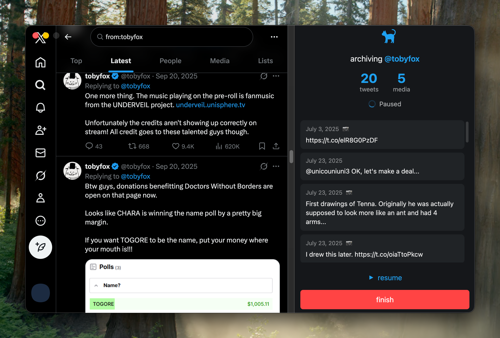
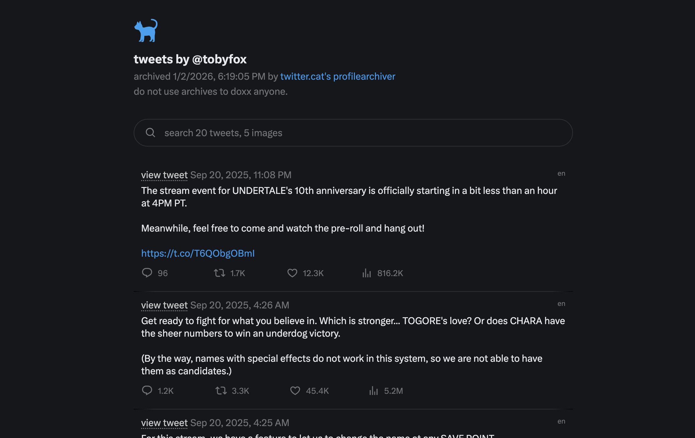

# TwitterArchiver

export anyone's tweets and media into a zip with an html viewer and csv.

## installation
  
* **windows**: [download exe](https://github.com/twitter-cat/twitterarchiver/releases/latest/download/TwitterArchiver-1.0.0.Setup.exe)

* **linux**
  * [debian-based distros](https://github.com/twitter-cat/twitterarchiver/releases/latest/download/twitterarchiver_1.0.0_amd64.deb)
  * [red hat-based distros](https://github.com/twitter-cat/twitterarchiver/releases/latest/download/twitterarchiver-1.0.0-1.x86_64.rpm)

* **macos**: [download dmg](https://github.com/twitter-cat/twitterarchiver/releases/latest/download/twitterarchiverdmg)  
  * alternatively, [download zip](https://github.com/twitter-cat/twitterarchiver/releases/latest/download/TwitterArchiver-darwin-arm64-1.0.0.zip)

  **important:** the macos app isn't signed. you'll need to remove it from quarantine after dragging it to Applications by running:
  
  `xattr -rd com.apple.quarantine TwitterArchiver.app`


alternatively, you can download the source code and build it yoursef:

```bash
git clone https://github.com/twitter-cat/twitterarchiver.git
bun make
```



## usage

### archiving a profile

1. tap "login with twitter". a window will open for you to login.

2. enter of search for the twitter handle of the user you want to archive. you can click any profile on the list.

3. tap "start archiving" and wait until you've archived as many tweets as you want. you can always pause to edit the search query. once you're done, tap "finish" and select a download location

### viewing your archive

your archive file is a zip that contains an html viewer, a csv with all tweets data and a folder with all of the media.



due to browser limitations on fetching files, you can't just open the html file directly on your browser.

if you'd like to **view it locally**, you can use a simple http server. if you have bun installed, unzip the file and run:

```bash
cd path/to/your/archive
bunx serve
```

if you'd like to share it with the internet, you're going to need to upload it to a web server.

if you already have your own solution, go with that. otherwise, we recommend using cloudflare pages:

1. [sign up](https://dash.cloudflare.com/sign-up/workers-and-pages)
2. tap "New application"
3. select "Upload your static files"
4. upload your zipped archive. feel free to customize the subdomain, then tap "Deploy"
5. deploying should take at most a few seconds. once you're done, click "visit"

## faq

**how can i be sure the prebuilt binaries are safe?**    
all releases are built by [this github action](https://github.com/twitter-cat/twitterarchiver/blob/main/.github/workflows/build.yaml). i couldn't add malware even if i wanted to. if you don't trust github, you can still build from source.

**why do i need to login with twitter?**    
twitter now requires authentication to use search, and the api is basically useless

**is my twitter login data stored anywhere?**    
only locally. we store your twitter cookies so you dont have to constantly log in. due to issues with logging in using the system keychain (specifically on macos), this data is stored in the `TwitterArchiverStore` file in your user data folder.

**why electron?**    
it's the best way to do with what this needs. managing 3 different codebases, each requiring to show webviews, retrieve cookies, execute javascript in webviews, and a decent ui isn't really feasible with other technologies

also, i like javascript.

**why not tauri?**    
it's not really any better, plus the complexity of rust and a smaller ecosystem.

## license
[AGPLv3.0](./LICENSE)

we strongly discourage using this software for any other malicious activity.     
please ensure you have permission before archiving tweets from any user.

***

built by [twitter.cat](https://twitter.cat)     
not affiliated with X Corp.
